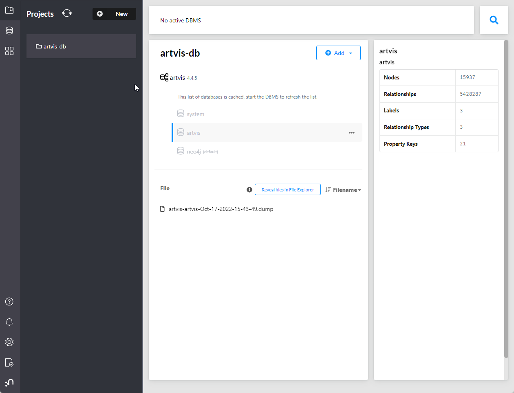
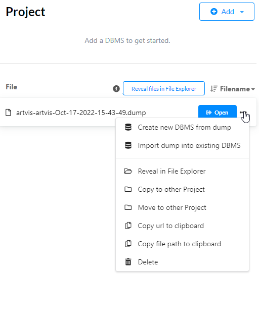
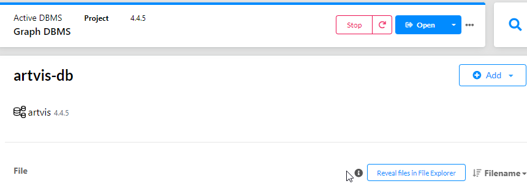

# ArtVis Graph DB Setup Guide

This guide covers how to set up the ArtVis Neo4j database locally on Linux/macOS, Windows, and using Docker for both development and deployment.

---

# Project Directory Structure & Contents

Below is an overview of the main files and folders in this project:

| Path / Name         | Description |
|---------------------|-------------|
| Dockerfile          | Builds the Neo4j Docker image with plugins, certificates, and import scripts. |
| README.md           | Setup and usage instructions. |
| dev.env / prod.env  | Environment variable files for development and production. |
| docker-compose.yml  | Docker Compose configuration for running Neo4j with all required settings. |
| import.sh           | Script to import the Neo4j dump file into the database. |
| neo4j.conf          | Neo4j configuration file (mostly standard, can be customized). |
| assets/             | Images for documentation (BROWSER.png, IMPORT.png, OPEN.png). |
| certificates/       | SSL certificates for secure connections. |
| certificates/bolt/  | Contains `private.key` and `public.crt` for Bolt protocol. |
| certificates/https/ | Contains `private.key` and `public.crt` for HTTPS. |
| csv/                | Data files in CSV and JSON format for import (artists, catalogues, exhibitions, locations, people, etc.). |
| cypher-scripts/     | Custom Cypher scripts for data processing and analysis (e.g., centrality calculation, network projection). |
| neo4j_dump/         | Contains the Neo4j database dump file (`neo4j.dump`). |
| plugins/            | Neo4j plugins required for the project (`apoc.jar`, `apoc-extended.jar`, `graph-data-science.jar`). |

This structure supports both local and Dockerized Neo4j setups, with data, scripts, and configuration organized for easy deployment and development.

---

## 1. Local Neo4j Installation (*nix/macOS)

### Prerequisites
- [Neo4j Desktop](https://neo4j.com/download-center/#desktop) (recommended) or [Neo4j Community/Enterprise Server](https://neo4j.com/download-center/#server)
- Java 17+ (if using Neo4j Server)

### Steps
1. Download and install Neo4j Desktop (version 1.5.X or later).
2. Open Neo4j Desktop and create a new project (e.g., `artvis-db`).
3. Create a new database (DBMS) or use "Create from dump" to import the provided dump file:
	- Place the `neo4j.dump` file from `neo4j_dump/` into the database's import directory.
	- Use the Desktop UI to load the dump (see screenshots below).
4. Set a password for the database (you'll need this for client connections).
5. Start the database and open the Neo4j browser to run queries.

---

## 2. Local Neo4j Installation (Windows)

### Prerequisites
- [Neo4j Desktop for Windows](https://neo4j.com/download-center/#desktop)

### Steps
1. Install Neo4j Desktop and launch it.
2. Create a new project (e.g., `artvis-db`).
3. Use the "reveal files in explorer" button to open the project directory.
4. Copy `neo4j.dump` from `neo4j_dump/` into the project directory.
5. In Neo4j Desktop, select "Create new DBMS from dump" and follow the prompts.
6. Set a password and start the database.
7. Use the Neo4j browser to explore and run queries.

---

## 3. Dockerized Setup (Development & Deployment)

### Prerequisites
- [Docker](https://docs.docker.com/get-docker/) installed and running
- (Optional) [Docker Compose](https://docs.docker.com/compose/)

### Environment Files
- `dev.env`: For local development (no SSL, default memory settings)
- `prod.env`: For production/deployment (SSL enabled, stricter settings)
	- **Note:** Credentials in these files are placeholders. Change them for production!

### Build and Run (Development)
```sh
cd artvis-graph-db
docker compose --env-file dev.env build
docker compose --env-file dev.env up
```

### Build and Run (Production/Deployment)
1. Ensure SSL certificates are present in `certificates/bolt` and `certificates/https` (your deployment script should handle this).
2. Update `prod.env` with secure credentials and any required settings.
3. Run:
```sh
docker compose --env-file prod.env build
docker compose --env-file prod.env up -d
```

---

## 4. Importing the Neo4j Dump File (Docker)

The Dockerfile and `import.sh` script will automatically import the dump file from `neo4j_dump/` during the build process. No manual action is needed unless you want to re-import data.

---

## 5. Additional Notes
- **Plugins:** Ensure the `plugins/` directory contains the required plugins compatible with your Neo4j version.
- **Certificates:** For production, valid SSL certificates are required. The Docker setup expects them in the specified directories.
- **Data Import:** For custom imports, adjust `import.sh` or use Neo4j's browser/CLI tools.
- **Troubleshooting:**
	- Check container logs with `docker logs artvis-db` if the service fails to start.
	- Ensure all mounted volumes and files exist and have correct permissions.

---


## 6. Screenshots (Neo4j Desktop)

Below are screenshots to help you identify key steps in the Neo4j Desktop setup process:

**1. Neo4j Desktop Project View**



**2. Importing the Dump File**

After copying the `neo4j.dump` file into the project directory, Neo4j Desktop will detect it for import:



**3. Opening the Database in Neo4j Browser**

Once the database is created and started, you can open the Neo4j browser to run queries and explore the data:


